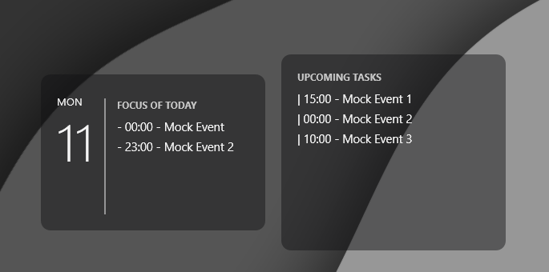

# MyWidgetCalendar 📅✨

A beautiful, premium, and dynamic Google Calendar widget for **Rainmeter**. Keep track of your daily and weekly schedule directly on your desktop with style.



## 🚀 Features

- 🌈 **Modern Aesthetics**: Sleek design with transparency, curated colors, and dynamic scaling.
- 🔄 **Auto-Update**: Automatically fetches your calendar events every 10 minutes.
- 📱 **Dynamic Scale**: Easily zoom the widget in or out by changing the `scale` variable.
- 🗓️ **Dual View**: Separate sections for Today's events and the Week's overview.

## 📥 Installation

1. Make sure you have [Rainmeter](https://www.rainmeter.net/) installed.
2. Download the `MyWidgetCalendar.rmskin` file from the [Releases](#) section.
3. Double-click the file to install it.

## ⚙️ Configuration

To make the widget show your events, you need to provide your private Google Calendar iCal link:

1. Go to **Google Calendar** on your browser.
2. On the left sidebar, find your calendar, click the 3 dots, and select **Settings and sharing**.
3. Scroll down to the bottom to find the **Secret address in iCal format** section.
4. Copy that long link.
5. Open the folder where the skin was installed (usually `Rainmeter\Skins\MyWidgetCalendar`).
6. Open `config.json` with a text editor and paste your link in the `ical_url` field:

```json
{
  "ical_url": "https://calendar.google.com/calendar/ical/.../basic.ics",
  "background_color": "18,18,20,120",
  "text_color": "245,245,245,255",
  "main_color": "200,200,200,255",
  "font_size": 11,
  "scale": 1.0
}
```

7. Save the file and **Refresh** the skin in Rainmeter.

## 🎨 Customization

You can edit `config.json` to change:
- `scale`: Zoom factor (e.g., `1.2` for 20% larger, `0.8` for 20% smaller).
- `background_color`: RGBA color for the background.
- `text_color`: RGBA color for the texts.

---

## 🛠️ Development (Open Source)

This widget is powered by a bundled Node.js executable that fetches and parses the iCal feed using `node-ical`.

If you want to contribute or modify the source code, check out the repository!

---
Developed with ❤️ by [HaackDEV](https://github.com/HaackDEV)
